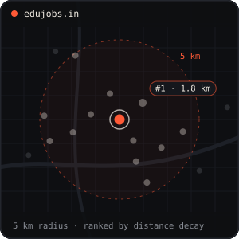

<p align="center">
  
</p>

<p align="center">
  <a href="https://edujobs.in"></a>
  <a href="https://zapfee.in"></a>
  <a href="https://suyashagrawal2004.github.io/"></a>
  <a href="https://www.linkedin.com/in/suyashagrawal2004/"></a>
  <a href="mailto:dm.suyash.a@gmail.com"></a>
</p>

## call notes

```text
post-call summary · auto-generated
----------------------------------------------------------------
caller       recruiter
intent       hire an engineer who can ship a product end to end
lead score   hot
heard        builds voice AI agents at Appiness Interactive
             built edujobs.in and zapfee.in solo, both live
             4,500+ tests across the two
background   B.Tech CSE, VIT-AP University (2022-2026), Bengaluru
next step    dm.suyash.a@gmail.com
----------------------------------------------------------------
```

## on the job

At **Appiness Interactive** I work on **Vola**, an AI voice campaign platform that runs autonomous outbound calls with live human hand-off. My part: a provider-agnostic voice engine gateway that put **Fish Audio** alongside **ElevenLabs** behind one interface, the in-browser voice preview flow, and the test suite that gates any release from dialling real numbers.

## shipped



### EduHire &nbsp;·&nbsp; [edujobs.in](https://edujobs.in)

A hyperlocal recruitment marketplace that matches preschool teachers to schools within 5 km. Built solo.

- **Spatial matching** on PostGIS with a hyperbolic distance-decay score, so rankings hold steady when a school widens its radius
- **One transaction per action**: every mutation, its audit entry, and its outbox email commit together or not at all
- **Locked down**: Supabase Auth with Google OAuth and magic links, default grants revoked, RLS on 20 tables
- **1,550+ Vitest and Playwright tests** in GitHub Actions against a throwaway PostgreSQL 17 + PostGIS container


<br clear="right" />



### ZapFee &nbsp;·&nbsp; [zapfee.in](https://zapfee.in)

Multi-tenant GST billing and double-entry accounting for Indian education institutes. Built solo.

- **Books that balance**: a double-entry ledger over 63 Postgres models where debits must equal credits, and paisa rounding lands in its own account instead of drifting
- **GST matrix** that decides tax invoice vs. bill of supply per institute type and SAC code
- **Claude Haiku vision** reads amount and UTR off UPI screenshots into strict JSON, at about ₹0.15 each
- **Security**: 4-role RBAC with branch scoping, TOTP MFA, RLS on every table, AES-256-GCM secrets, HMAC-verified Razorpay webhooks


<br clear="right" />

<sub>earlier builds: [Music Maestro](https://github.com/suyashagrawal2004/music-maestro) · [MixNMatch](https://github.com/suyashagrawal2004/MixNMatch) · [Stonks](https://github.com/suyashagrawal2004/Stonks)</sub>

## stack


## activity

<p align="center">
  
  
</p>

<p align="center">
  
</p>

<p align="center">
  <picture>
    <source media="(prefers-color-scheme: dark)" srcset="https://raw.githubusercontent.com/suyashagrawal2004/suyashagrawal2004/output/call-snake.svg" />
    <source media="(prefers-color-scheme: light)" srcset="https://raw.githubusercontent.com/suyashagrawal2004/suyashagrawal2004/output/github-snake.svg" />
    
  </picture>
</p>

<p align="center">
  
</p>
